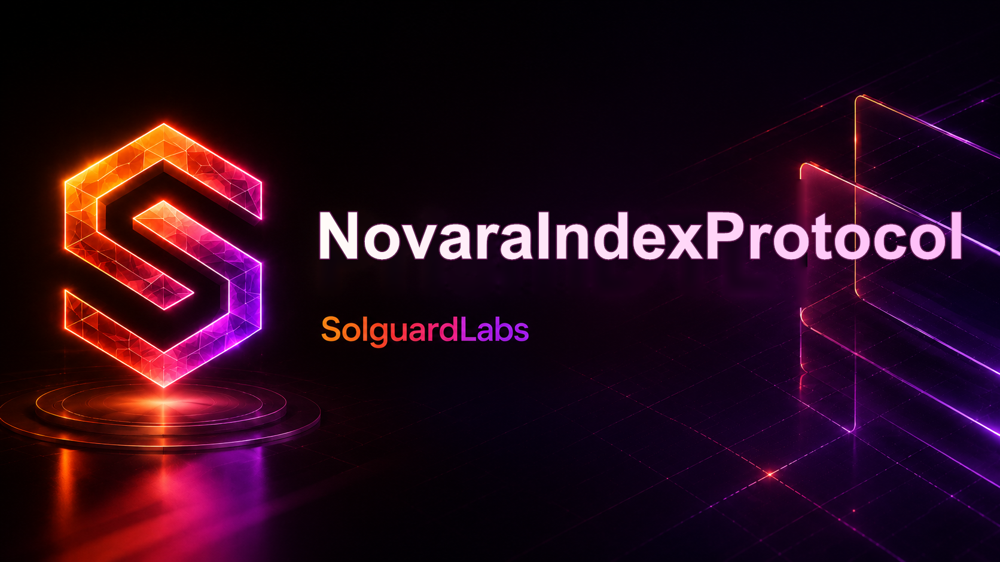

# Novara Index Protocol



Novara Index Protocol es un protocolo Vyper para emitir y redimir un token de indice
respaldado por una cesta de ERC20. La boveda principal mantiene pesos objetivo por componente,
admite rebalanceos programados y permite sustituir componentes mediante una ventana operacional
controlada por keeper.

## Componentes

- `NovaraIndexProtocol`: boveda principal para mint, redeem, pausas, rebalanceos y sustituciones.
- `NovaraIndexToken`: ERC20 de 18 decimales emitido por la boveda.
- `NovaraPriceOracle`: oraculo administrado con limites por feed y control de staleness.
- `NovaraComponentRegistry`: catalogo auxiliar de componentes, pesos y limites operativos.
- `NovaraRebalancePlanner`: planificador de cambios de peso con ventana temporal.
- `NovaraRedemptionQueue`: cola opcional para liquidaciones asincronas.
- `NovaraRiskPolicy` y `NovaraCircuitBreaker`: validaciones de riesgo y movimientos de NAV/PPS.
- `NovaraIndexLens`, `NovaraAccountLens` y `NovaraOperationsLens`: vistas agregadas para auditoria.
- `NovaraBasketMath`: utilidades puras de ponderacion, prorrata y desviaciones.

## Requisitos

- Python 3.11 o superior.
- Dependencias de `requirements.txt`.

Instalacion local recomendada:

```bash
python -m venv .venv
source .venv/bin/activate
python -m pip install -r requirements.txt
```

PowerShell:

```powershell
python -m venv .venv
.\.venv\Scripts\Activate.ps1
python -m pip install -r requirements.txt
```

## Tests

```bash
bash scripts/tests.sh
```

PowerShell:

```powershell
.\scripts\tests.ps1
```

La suite Python despliega los contratos con Titanoboa y valida composicion de cesta, emision,
redencion prorrata, cambios de peso, pausas y finalizacion de sustituciones.

## CI

```bash
bash scripts/ci.sh
```

El CI compila todos los contratos Vyper de `src/`, ejecuta Ruff sobre tests/scripts y corre la
suite `pytest`.

## Estructura

```text
src/
  access/       roles y autorizacion operativa
  accounting/   ledger de comisiones por activo
  core/         registro de componentes
  lens/         vistas de indice, cuentas y operaciones
  libraries/    matematicas de cesta
  mocks/        ERC20 de pruebas
  modules/      rebalance, cola, circuit breaker y coordinadores
  oracle/       feeds de precio
  policy/       politicas de riesgo e invariantes
  token/        token de indice
  vault/        boveda principal
tests/          tests Python de integracion
scripts/        wrappers reproducibles de compilacion, test y CI
```
